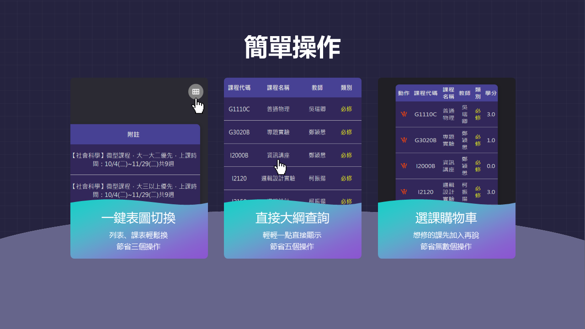
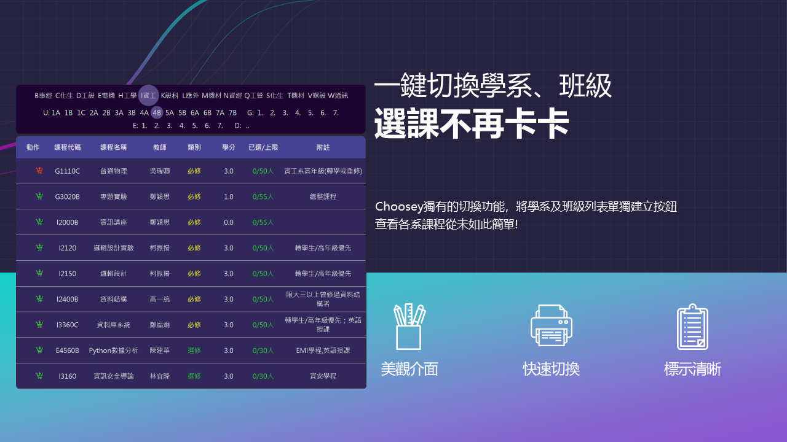
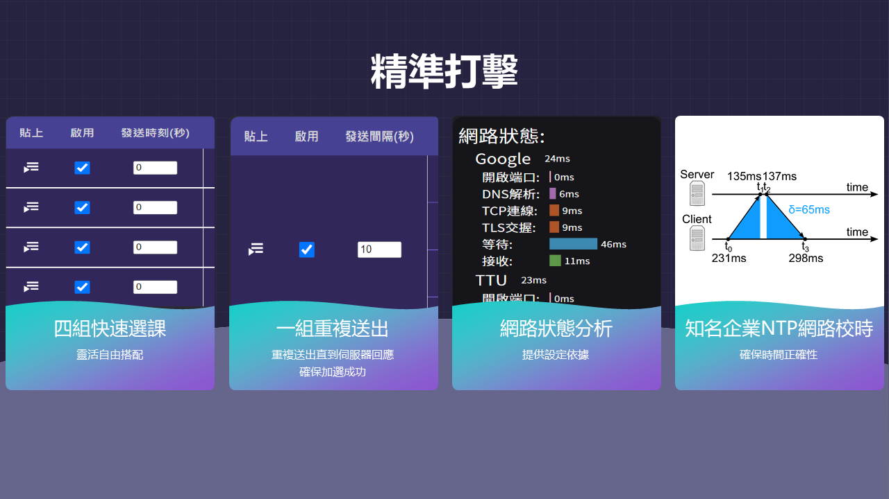
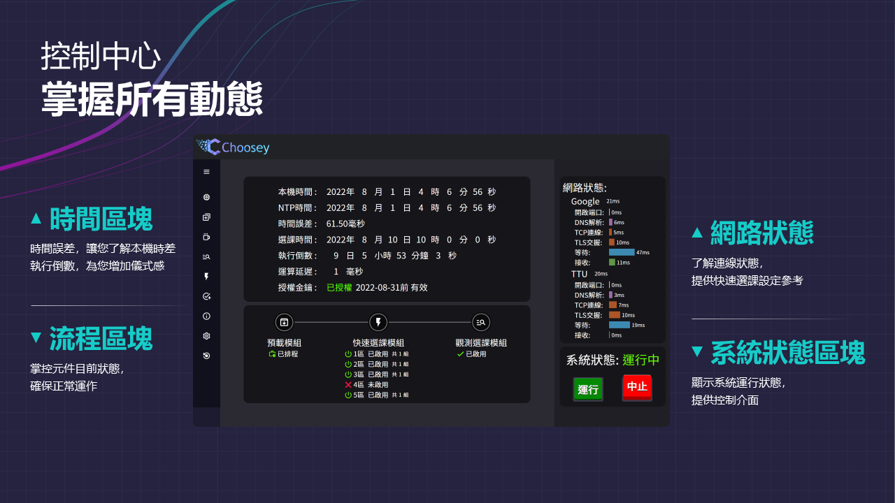
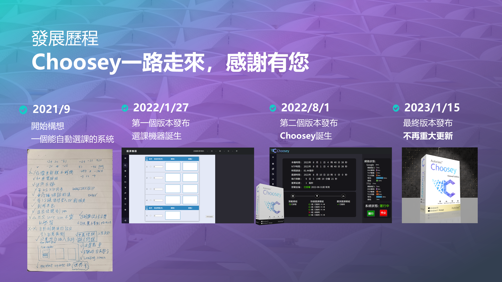

    
     

# Choosey - 先進的選課管理系統

想像一個不需複雜操作、可提前規劃、全自動但又可微調的選課系統， 
聽起來很夢幻嗎? 
但其實就在你的眼前!

專為大同大學系統量身訂做， 
基於Node.js的Electron應用程式， 
Choosey開發團隊致力於打造完美的選課體驗!

## Features
目前版本包含以下功能:

### 選課前規劃
* 查詢各班課程
* 查詢通識課程
* 一鍵切換課程列表與時間表
* 點擊課程名稱直接顯示課程大綱
* 選課購物車

    
     
    

### 選課操作
* 四組定時快速選課
* 一組間格重複快速選課
* 網路狀態分析
* NTP網路校時
* 24小時課程名額監測

    
     
    

### 系統管理
* 時差監測
* 流程監測
* 網路監測
* 系統開關

    

## Install
在[releases](https://github.com/jerry88897/Choosey/releases)頁面尋找 **最新的版本。**
## TODO
* 更有效的選課方式
* 更方便的操作
* 更可靠的系統
## Community
需要支援或有想法要告訴我們嗎? 
歡迎加入我們的[Discord社群](https://discord.gg/29AbBJ48Hk) 
email也行 chooseydev@gmail.com
## Special Thanks
感謝所有勇敢的測試人員 
感謝所有陣亡人員的犧牲，造就了我們的進步 
感謝美術總監對開發者無限的付出與支持

    

## License
[GPL-3.0](https://github.com/jerry88897/Choosey/blob/main/LICENSE)
